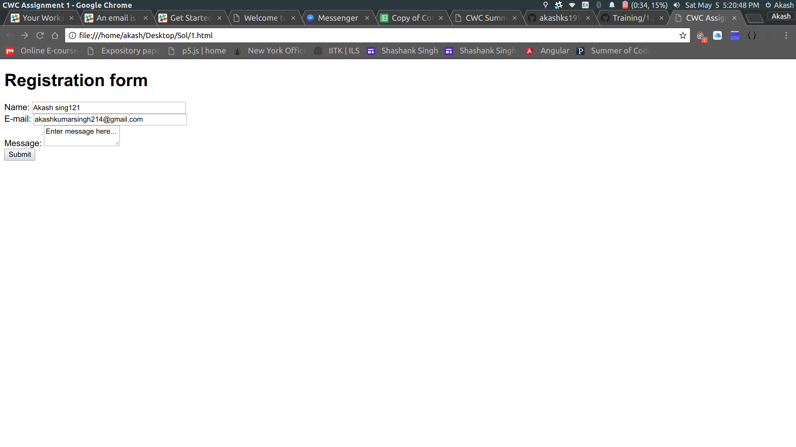

# Training
This repository is for CWC volunteers to learn basic HTML, CSS, JS and Git/GitHub.
## Task 1
Deadline- 5th April
Request for homepage.
Details are provided [here](http://www.iitk.ac.in/cc/homepage/)
## Assignment 1
## Its time for basic HTML
Deadline- 7th April
[This is a basic tutorial for HTML](https://www.youtube.com/watch?v=Ggh_y-33Eso)
[Other useful material](https://www.w3schools.com/html/)

You have to create a page which looks similar to the one provided above. And follow the below constraints. 
name : Maximum 20 characters with only english alphabets and space 
email should be of the form “someone@xyz.com” where leftside may contain
english alphabets only and rightside must end with a “.com” domain name
Message must be a textarea.
## Assignment 2
## Its time for basic CSS
Deadline- 10th April
[This is basic tutorial for CSS](https://www.youtube.com/watch?v=CUxH_rWSI1k)
Other useful material: W3 schools

You have to create a page which looks similar to the one provided above. And follow the below constraints. 
a. name : Maximum 20 characters with only english alphabets and space
b. address: Maximum 100 characters
c. email should be of the form “someone@xyz.com” where leftside may contain
english alphabets only and rightside must end with a “.com” domain name
d. Mobile number is a 10-digit numeric value
e. Bank account number is a 5-digit numeric value
f. Bank password can be maximum 20 alphanumeric characters and should not
be displayed when entered in the textbox.
## Assignment 3
## Your homepage
Deadline- 13th April
In this Assignment you need to create your homepage. You are allowed to use templates.
## Assignment 4
## Time to learn Git
Deadline- 17th April
[I loved this tutorial series](https://www.youtube.com/watch?v=BCQHnlnPusY&list=PLRqwX-V7Uu6ZF9C0YMKuns9sLDzK6zoiV)
[Another lovely tool](https://try.github.io/levels/1/challenges/1)
Create a Github account 
Pull this repository 
Put all the files of previous Assignments in a folder named "your_roll no" 
And create a push request.
